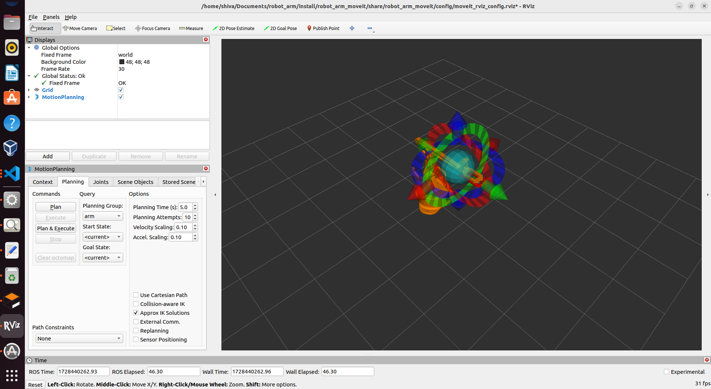

# 3- DOF Robot Arm with Voice Control from Alexa

This project involves developing a voice-controlled robotic arm that can receive commands via Alexa and execute them through precise trajectory planning and control. Using ROS 2 as the framework for communication, Gazebo for realistic physics simulation, and MoveIt for trajectory planning and execution, this project creates a fully functional digital twin of the robotic arm compatible with real-world scenarios.


The code is designed to be adaptable, allowing the robotic arm to perform actions through both keyboard inputs and a RVIZ (GUI) (for now), with future updates planned to incorporate these features and expand control options.
## Installation


**Prequisites**

* Ubuntu 22.04 LTS

* ROS2 humble

* Gazebo

**Step 1: Install ROS 2 Humble** 

Follow the [ROS 2 Humble installation](https://docs.ros.org/en/humble/Installation.html) instructions for your operating system if ROS 2 is not already installed.

**Step 2: Install Required ROS 2 Packages** 

Install the necessary ROS 2 packages.
```bash
sudo apt-get install ros-humble-ros2-control
sudo apt-get install ros-humble-ros2-controllers
sudo apt-get install ros-humble-xacro
sudo apt-get install ros-humble-ros-gz-*
sudo apt-get install ros-humble-*-ros2-control
sudo apt-get install ros-humble-joint-state-publisher-gui
sudo apt-get install ros-humble-tf-transformations
sudo apt-get install ros-humble-moveit*


```
**Step 3: Install Python Packages for Alexa Integration** 

Install Python and additional packages to create the Alexa voice interface:
```bash
sudo apt-get install python3-pip python3-transforms3d python3-flask
pip3 install pyserial --break-system-packages
pip3 install flask-ask-sdk --break-system-packages
pip3 install ask-sdk --break-system-packages
```
**Step 4: Additional Packages for Hardware Communication** 

To enable communication between the Arduino and ROS 2 using the Serial protocol:
```bash
sudo apt-get install libserial-dev
```

## Run Locally

Clone the project

```bash
  git clone git@github.com:shivasamkumar/3_Dof_Robot_Arm_Controller.git
```

Go to the project directory

```bash
  cd 3_Dof_Robot_Arm_Controller-main
```

build the project

```bash
  colcon build 
```

Launch the project

```bash
  ros2 launch robot_arm_bringup final_robot_arm.launch.py
```


## Demo



**Video**
This demo shows the Pick and Place Operation with Alexa voice control 

[](https://drive.google.com/file/d/18mpOHGg4pO1Uzi7PCq4JB4PMeyOLlSbH/view?usp=sharing)


## Future versions 
**Web-Based GUI**

Integrating a web-based control interface for remote access and operation, enabling users to control the robotic arm from any device with internet access.
